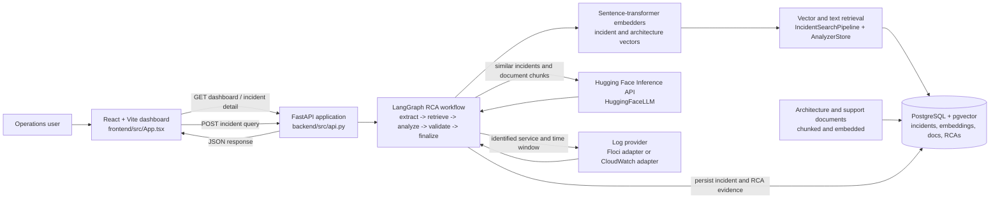
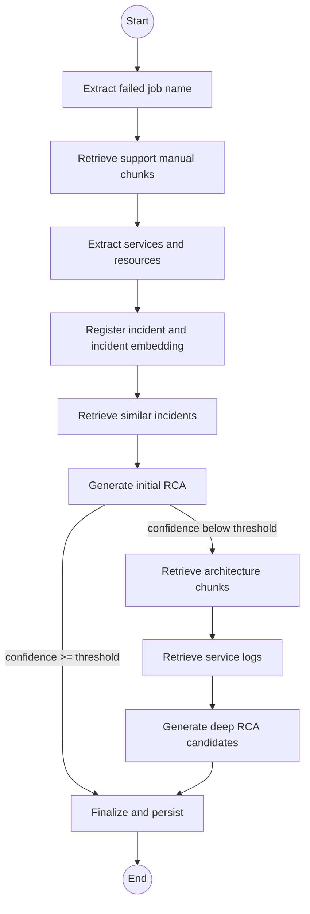
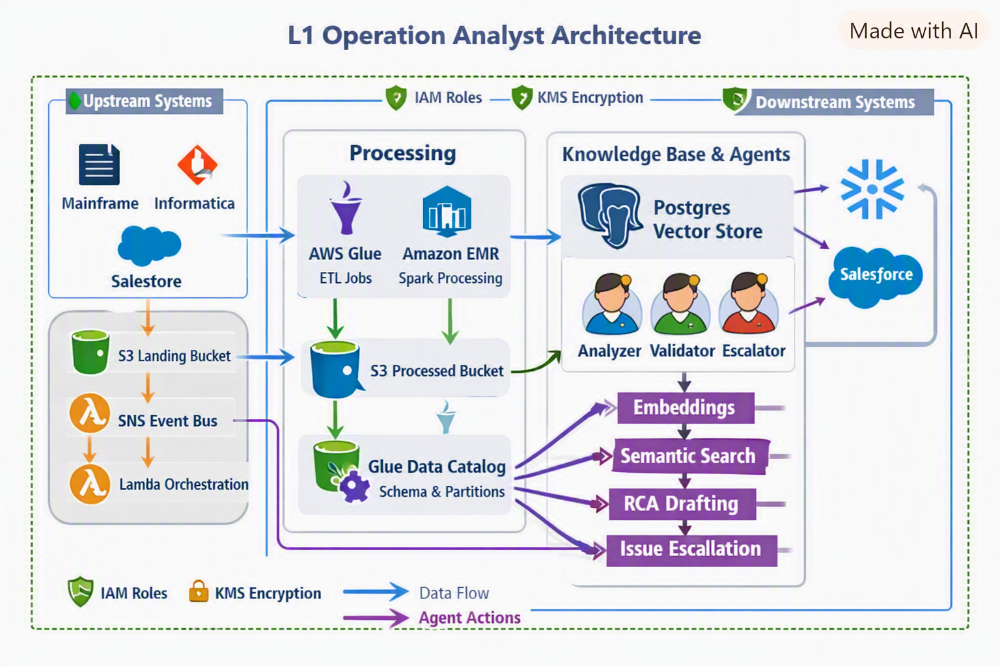
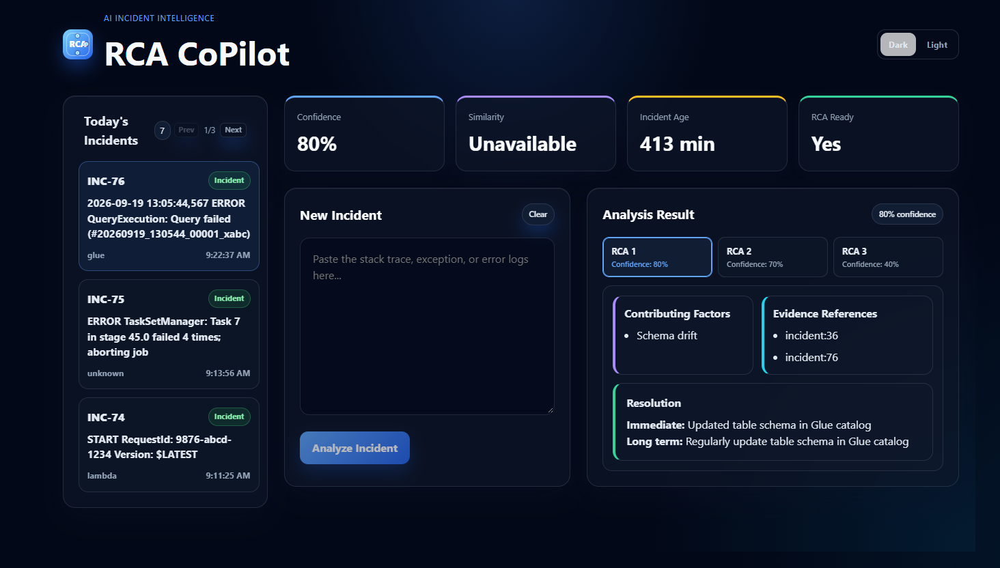

# RCA L1 CoPilot

RCA L1 CoPilot is an incident triage and root-cause-analysis dashboard for L1 operations teams. An operator can paste a stack trace or error log, submit it to an evidence-oriented analyzer, review historical incident matches, and inspect one or more RCA candidates with their confidence, contributing factors, evidence references, and proposed resolution.

The application is split into a React/Vite frontend, a FastAPI backend, and a PostgreSQL database with pgvector support. The backend uses a LangGraph workflow to coordinate incident registration, retrieval, model calls, validation, and persistence.

## Product Workflow

1. The frontend loads today's incidents from `GET /api/dashboard/today`.
2. The operator selects an existing incident or pastes a new trace into the **New Incident** textarea.
3. **Analyze Incident** sends the trace to `POST /api/incidents/analyze`.
4. The backend creates the incident, generates its embedding, and searches historical incidents and architecture documents.
5. The analyzer asks the configured Hugging Face model for a strict JSON RCA response.
6. Low-confidence responses enter the deeper architecture and log-retrieval branch.
7. The result is validated and persisted in `analyzer_rcas`.
8. The frontend refreshes the sidebar and renders the selected RCA candidates.

## Architecture



### Architecture Components

| Component | Location | Responsibility |
| --- | --- | --- |
| React dashboard | `frontend/src/App.tsx` | Loads incidents, manages selected incident and textarea state, submits analysis requests, paginates the sidebar, and renders RCA cards. |
| Vite build | `frontend/vite.config.ts` and `frontend/package.json` | Serves the development UI and produces the production bundle. |
| FastAPI application | `backend/src/api.py` | Exposes health, dashboard, incident-detail, and analysis endpoints. It also configures CORS for the local Vite origins. |
| Dashboard store | `backend/src/agents/analyzer_agent/dashboard_store.py` | Reads today's incidents and the latest RCA for each incident. |
| RCA facade | `backend/src/agents/analyzer_agent/agent.py` | Creates the embedders, search pipeline, LLM adapter, node collection, and compiled LangGraph. |
| LangGraph workflow | `backend/src/agents/analyzer_agent/graph.py` | Defines the ordered and conditional execution path for RCA generation. |
| Analyzer nodes | `backend/src/agents/analyzer_agent/nodes.py` | Extract job names, retrieve support manual entries, identify services, register incidents, retrieve matches, call the model, optionally retrieve logs, and finalize state. |
| Analyzer store | `backend/src/agents/analyzer_agent/analyzer_store.py` | Searches architecture chunks and persists incident embeddings and RCA evidence. |
| Incident search | `backend/src/scripts/search_incidents.py` | Embeds the incoming query and searches historical incident vectors with pgvector. |
| Embeddings | `backend/src/embeddings/incident_embeddings.py` | Creates embeddings and stores them in the incident vector table. |
| LLM adapter | `backend/src/agents/analyzer_agent/llm_client.py` | Calls Hugging Face chat completion using `HF_RCA_MODEL_ID` and `HUGGINGFACEHUB_API_TOKEN`. |
| Log providers | `backend/src/agents/analyzer_agent/log_providers.py` | Provides a provider interface plus Floci and CloudWatch implementations. The API currently wires a local empty Floci client. |
| PostgreSQL | `docker-compose.yml` | Runs the `ankane/pgvector` image and stores incidents, document chunks, embeddings, and analyzer RCAs. |

### RCA Graph



The graph's confidence threshold defaults to `95` in `RCAAnalyzerAgent`. The exact model response is validated by the RCA validation helpers before the workflow is finalized. The final state includes the incident ID, RCA candidates, selected RCA, confidence, and evidence metadata.

## Architecture Diagram Reference

The following diagram shows the broader L1 Operation Analyst architecture, including upstream systems, data processing, the PostgreSQL vector store, RCA agents, downstream systems, security controls, data flow, and agent actions.



### UI Card and Component Guide



#### Header

- **RCA CoPilot brand block**: Identifies the application and presents the `RCA` mark.
- **Dark / Light toggle**: Switches the `theme` state in `App.tsx`; the root element receives either the `dark` or `light` class.

#### Today's Incidents sidebar

- **Incident count**: Shows the number returned by the dashboard endpoint.
- **Previous / page / Next**: Moves through the local incident list. The current source sets `INCIDENTS_PER_PAGE = 3`, so three incidents are displayed per page.
- **Incident card**: Shows the incident ID, first line of the error log, service, and local time. Clicking a card calls `GET /api/incidents/{incident_id}` and makes that incident the active selection.
- **Active incident styling**: The selected incident receives the `active` card class so the operator can see which record drives the workspace.

#### Statistic cards

These appear when a selected incident has a displayable RCA result:

- **Confidence**: Displays the selected candidate's `confidence_hint` as a percentage.
- **Similarity**: Currently displays `Unavailable`; the backend does retrieve similar incidents, but this dashboard card is not yet wired to a similarity score.
- **Incident Age**: Calculates elapsed minutes from `created_at` to the browser's current time.
- **RCA Ready**: Indicates that an RCA result is available for the selected incident.

#### New Incident panel

- **New Incident heading**: Marks the operator input area.
- **Clear button**: Sets only the `stackTrace` state to an empty string. It does not delete incidents or clear the selected RCA.
- **Textarea**: Accepts a stack trace, exception, or error log. It is a controlled React input.
- **Analyze Incident button**: Disabled for an empty textarea or while a request is running. It sends the query to the backend and changes its label to `Analyzing...` during the request.
- **Error box**: Shows request or validation errors returned by the frontend flow.

#### Analysis Result panel

- **Confidence pill**: Repeats the active RCA candidate confidence beside the panel title.
- **RCA tabs**: Each candidate is rendered as a tab with its candidate number and confidence. Selecting a tab changes `activeRcaIndex`.
- **Contributing Factors card**: Lists factors returned by the model, or displays `None recorded.` when the list is empty.
- **Evidence References card**: Lists provenance strings such as `incident:36` or `chunk:12`, allowing the operator to see which supplied evidence informed the candidate.
- **Resolution card**: Shows the model's immediate mitigation and long-term corrective action.
- **Empty state**: If no incident is selected, the workspace explains that the operator can select a sidebar incident or paste a new trace.

## API Reference

### `GET /health`

Returns a lightweight process check:

```json
{"status":"ok"}
```

### `GET /api/dashboard/today`

Returns today's incidents ordered newest first, with the latest related RCA when one exists:

```json
{
  "incidents": [
    {
      "incident_id": 76,
      "service": "glue",
      "error_log": "...",
      "root_cause": null,
      "resolution": null,
      "validated": false,
      "created_at": "2026-09-19T13:05:44.567000",
      "rca_id": 12,
      "rca_json": {},
      "evidence": {},
      "rca_created_at": "2026-09-19T13:06:10.000000"
    }
  ],
  "count": 1
}
```

### `GET /api/incidents/{incident_id}`

Returns one incident with its latest RCA, or `404` when the ID does not exist.

### `POST /api/incidents/analyze`

Request:

```json
{"incident_query":"Job ERROR: example-job failed ..."}
```

The query must not be empty. The endpoint registers the incident, runs the RCA workflow, persists evidence, and returns the stored incident details.

Interactive API documentation is available at `http://127.0.0.1:8000/docs` when the backend is running.

## Prerequisites

- Windows PowerShell or another shell
- Python `>=3.12,<3.13`
- Poetry
- Node.js and npm
- Docker Desktop with Compose
- A Hugging Face instruction-tuned text-generation model and token

## Configuration

Create or update the root `.env` file. Do not commit secrets:

```dotenv
DB_HOST=localhost
DB_NAME=kb_db
DB_USER=postgres
DB_PASS=postgres
DB_PORT=5433
HF_RCA_MODEL_ID=your-instruction-tuned-model
HUGGINGFACEHUB_API_TOKEN=your-token
AWS_REGION=us-east-1
```

`DB_CONFIG` loads these values in `backend/src/config/db_config.py`. The API's current `FlociClient` returns no logs until a production Floci client is supplied. The repository also includes a `CloudWatchLogProvider` for a future AWS-backed configuration.

## Local Setup

### 1. Start PostgreSQL with pgvector

From the repository root:

```powershell
docker compose up -d
```

The database is exposed on host port `5433` and is available as database `kb_db`. To recreate the volume and data from scratch, use this destructive sequence only when you intend to delete local database data:

```powershell
docker compose down -v
docker compose up -d
```

The SQL files under `backend/sql/` describe the schema and seed data. Apply them through `psql` or your preferred migration process when initializing a new database. The current Compose file starts PostgreSQL but does not automatically run the SQL files.

### 2. Install and run the backend

```powershell
cd backend
poetry install
poetry run python -m uvicorn src.api:app --reload
```

The API runs at `http://127.0.0.1:8000`.

### 3. Install and run the frontend

In a second terminal:

```powershell
cd frontend
npm install
npm run dev
```

The dashboard runs at `http://localhost:5173`.

### 4. Verify the services

```powershell
Invoke-WebRequest http://127.0.0.1:8000/health
```

Open `http://localhost:5173` in a browser and confirm that the incident sidebar loads.

## Development Commands

Backend:

```powershell
cd backend
poetry run python -m uvicorn src.api:app --reload
```

Frontend:

```powershell
cd frontend
npm run dev
npm run build
npm run lint
```

The production frontend build runs TypeScript compilation followed by Vite bundling.

## Database Tables

- `incidents`: incoming incidents, service, error log, validation flag, and timestamps.
- `incident_embeddings_768`: vector representation used for historical incident search. The analyzer expects 768 dimensions.
- `architecture_docs`: source architecture and support documents.
- `architecture_doc_chunks`: searchable document chunks and their metadata/vector embeddings.
- `analyzer_rcas`: generated RCA JSON, incident IDs, original query, and evidence provenance.

The SQL directory contains several historical schema files. Review the target database schema before applying them to an existing database because `001_init_schema.sql` contains overlapping definitions from different embedding iterations.

## Repository Layout

```text
.
|-- README.md
|-- docker-compose.yml
|-- run_app.txt
|-- backend
|   |-- pyproject.toml
|   |-- sql
|   |-- src
|       |-- api.py
|       |-- agents/analyzer_agent
|       |-- config
|       |-- embeddings
|       |-- scripts
|       `-- utils
|-- docs
|   `-- DataLake_application_architect.png
`-- frontend
    |-- package.json
    |-- src/App.tsx
    |-- src/App.css
    |-- src/index.css
    `-- public
```

## Troubleshooting

### Backend exits immediately

Confirm that you are in `backend`, that Poetry installed the dependencies, that Python is in the supported version range, and that `DB_PASS` is set. Run `poetry run python -m uvicorn src.api:app --reload` so the Poetry environment is used.

### Dashboard cannot load incidents

Check that the database container is running with `docker ps`, confirm port `5433` is reachable, and verify that the schema and seed data were applied. Then check `http://127.0.0.1:8000/health` and the backend terminal output.

### Analysis fails while the dashboard loads

The dashboard health and incident reads can work before the analyzer is initialized. Analysis additionally requires `HF_RCA_MODEL_ID`, a valid Hugging Face token when the selected model needs one, usable vector tables, and compatible embedding dimensions.

### Browser reports a CORS error

Use `http://localhost:5173` or `http://127.0.0.1:5173`. Those are the origins currently allowed by the FastAPI middleware.

## Current Limitations

- Frontend API URLs are hard-coded to `http://localhost:8000`.
- The sidebar pagination is client-side and currently displays three incidents per page.
- Similarity is retrieved by the backend workflow but the dashboard statistic is still labeled `Unavailable`.
- The API wires an empty Floci client, so the local analyzer does not receive production log data.
- SQL initialization is manual and the schema directory contains overlapping historical definitions that should be consolidated before production deployment.
